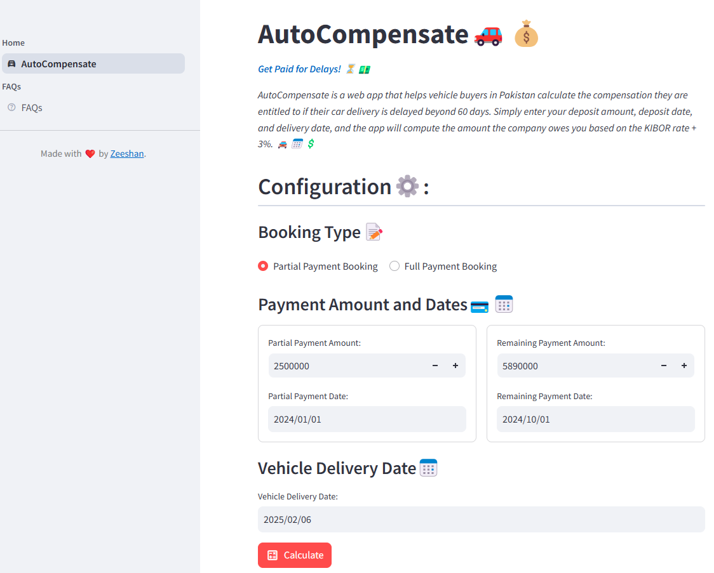

# AutoCompensate🚗💰
Get Paid for Delays! ⏳💵

AutoCompensate is a web app that helps vehicle buyers in Pakistan calculate 
the compensation they are entitled to if their car delivery is delayed beyond 
60 days. Simply enter your deposit amount, deposit date, and delivery date, and 
the app will compute the amount the company owes you based on the 
KIBOR rate + 3%. 🚘📅💲

# Application Link
-

# Technologies Used
* streamlit -- Front end development
   
# System Requirements
You must have Python 3.11 or later installed.

# Installation
1.  Clone this repository
2. Create a virtual environment
3. Install the necessary python packages:
   `pip install -r requirements.txt`
4. Run the application with following command from terminal:

   `streamlit run main.py`

# Screen Shots
()